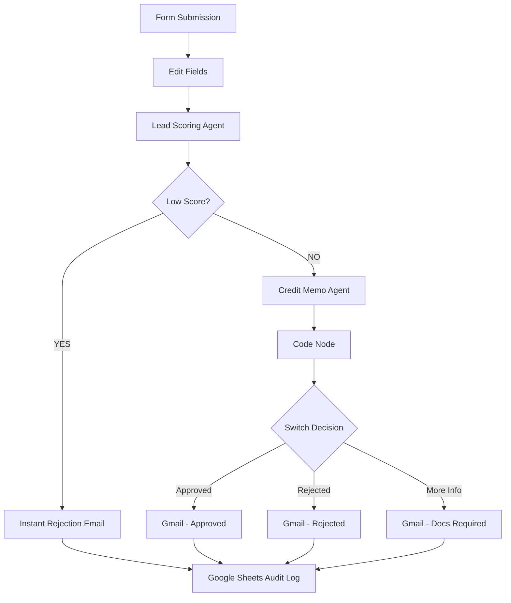
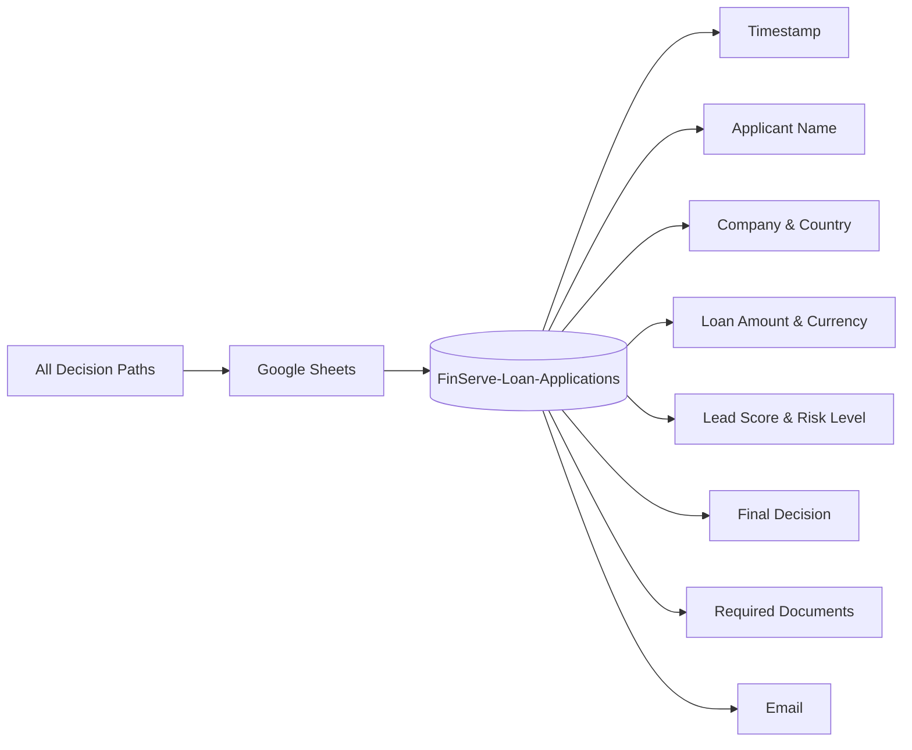
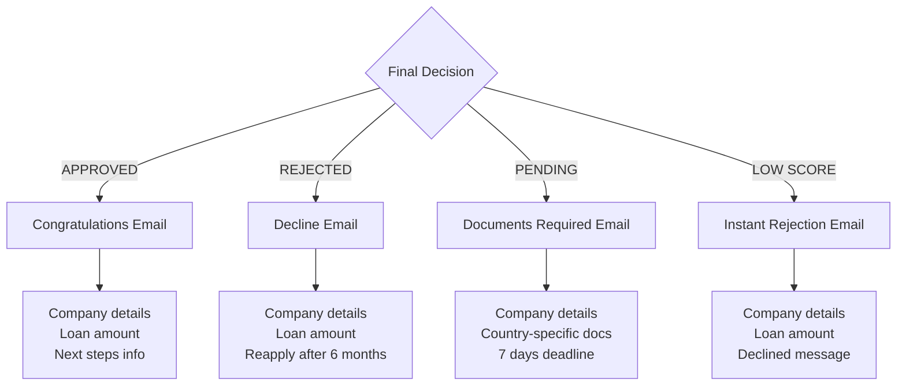

# 🏦 FinServe AI Loan Origination Pipeline

> An end-to-end AI-powered loan origination automation built with **n8n**, **Ollama (llama3.2)**, and local LLM — processing applications from form submission to decision in under 2 minutes.

---

## 📌 Overview

FinServe is a mid-size financial services company offering lending and credit products to SMEs and retail clients. This project automates the **entire loan origination process** — from lead qualification to credit decision and customer notification — replacing a manual process that previously took 2–3 days.

---

## 🚀 What This Workflow Does

| Stage | Description |
|-------|-------------|
| 📋 **Form Submission** | Customer submits loan application via n8n form |
| 🧠 **Lead Scoring** | AI Agent scores the lead (HIGH / MEDIUM / LOW) |
| 📄 **Credit Memo Generation** | AI Agent generates a structured credit memo |
| ⚡ **Decision Routing** | Auto-routes to Approved / Rejected / More Info paths |
| 📧 **Email Notification** | Professional HTML email sent to applicant |
| 📊 **Audit Logging** | All decisions logged to Google Sheets |

---

## 🗺️ Workflow Architecture


### Flow Explanation

```
Form Submission
      ↓
Edit Fields (data formatting)
      ↓
Lead Scoring Agent (llama3.2:3b)
      ↓
IF Node — Low Score?
  ↓ YES                    ↓ NO
Gmail (Instant           Credit Memo Agent
Rejection)               (llama3.2:3b)
                              ↓
                         Code Node
                         (decision extract)
                              ↓
                         Switch Node
                      ↓        ↓        ↓
                  Approved  Rejected  More Info
                      ↓        ↓        ↓
                   Gmail    Gmail    Gmail
                      └────────┴────────┘
                                ↓
                        Google Sheets (Audit Log)
```

---

## 📊 Google Sheets Audit Log

All loan applications are automatically logged with full details:



### Logged Fields
- Timestamp, Applicant Name, Company, Business Type
- Country, Currency, Loan Amount, Monthly Revenue
- Lead Score, Risk Level, AI Recommendation
- Final Decision, Required Documents, Email

---

## 📧 Email Notifications

Professional HTML emails sent automatically based on decision:



### Email Types

| Decision | Email Content |
|----------|--------------|
| ✅ APPROVED | Congratulations message + next steps |
| ❌ DECLINED | Polite rejection + reapply after 6 months |
| ⏳ PENDING | Specific documents required by country |

---

## 🌍 Multi-Country & Currency Support

The workflow handles country-specific compliance requirements automatically:

| Country | Currency | Compliance Documents |
|---------|----------|---------------------|
| 🇮🇳 India | INR | GST returns, ITR filing, MSME certificate |
| 🇺🇸 USA | USD | Federal tax returns, EIN verification |
| 🇫🇷 France/EU | EUR | VAT registration, EU business license, IBAN |
| 🇵🇱 Poland | PLN | NIP number, ZUS registration, VAT-7 |
| 🇦🇪 UAE | AED | Standard KYC documents |

---

## 🛠️ Tech Stack

| Component | Technology |
|-----------|-----------|
| Automation | n8n (self-hosted via Docker) |
| LLM | Ollama + llama3.2:3b (local) |
| Embeddings | nomic-embed-text (local) |
| Vector DB | Qdrant (Docker) |
| Email | Gmail API |
| Logging | Google Sheets API |
| Form | n8n Form Trigger |

---

## ⚙️ Setup & Installation

### Prerequisites
```bash
# Required
Docker Desktop
Ollama
n8n (Docker)
Qdrant (Docker)
```

### Step 1 — Pull Required Models
```bash
ollama pull llama3.2:3b
ollama pull nomic-embed-text
```

### Step 2 — Start Services
```bash
# Start Qdrant
docker run -d -p 6333:6333 qdrant/qdrant

# Start n8n
docker run -d --name n8n -p 5678:5678 -v n8n_data:/home/node/.n8n n8nio/n8n:1.68.0

# Start Ollama (allow Docker access)
$env:OLLAMA_HOST="0.0.0.0:11434"; ollama serve
```

### Step 3 — Import Workflow
```
1. Open n8n → localhost:5678
2. New Workflow → Import from file
3. Select workflow.json
4. Configure credentials:
   - Gmail OAuth
   - Google Sheets OAuth
   - Ollama (http://host.docker.internal:11434)
```

---

## 🧪 Test the Workflow

### Sample Test Data
```json
{
  "Applicant Name": "Priya Sharma",
  "Company Name": "Sharma Exports Pvt Ltd",
  "Business Type": "Export Trading",
  "Years in Business": 8,
  "Monthly Revenue": 500000,
  "Loan Amount Requested": 1000000,
  "Purpose": "Export inventory expansion",
  "Email": "your@email.com",
  "Country": "India",
  "Currency": "INR"
}
```

### Expected Results by Profile

| Profile | Years | Revenue | Loan | Expected Decision |
|---------|-------|---------|------|------------------|
| Strong | 8+ | High | 2x revenue | APPROVED |
| Weak | 0 | Low | 100x revenue | REJECTED (instant) |
| Medium | 3 | Medium | 5x revenue | PENDING - DOCS |

---

## 📁 Repository Structure

```
finserve-ai-loan-origination-pipeline/
├── workflow.json          # n8n workflow export
├── README.md              # This file
└── screenshots/
    ├── workflow.png       # Full workflow diagram
    ├── sheets.png         # Google Sheets audit log
    └── email.png          # Email notification example
```

---

## 🔮 Future Enhancements

- **RAG Integration** — KYC policy documents via Qdrant vector store
- **Larger LLM** — GPT-4 / Claude for consistent decisions
- **CRM Integration** — Auto-update lead status in CRM
- **Document Upload** — Customer uploads docs directly in form
- **Deduplication** — Prevent duplicate applications
- **Dashboard** — Real-time loan pipeline analytics

---

## ⚠️ Known Limitations

- Using llama3.2:3b (small model) due to hardware constraints — production would use 70B+ model
- No deduplication logic currently implemented
- RAG/KYC policy check planned but not yet implemented

---

## 👨‍💻 Author

Built as part of a technical assessment for an AI Intern position at 10Clouds Financial Institutions.

---

## 📄 License

MIT License — see [LICENSE](./LICENSE) for details.
